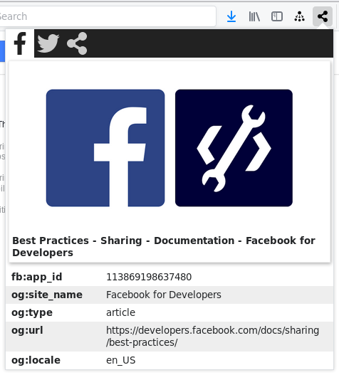

#  Metaview



View social meta tags for a website in a popup directly from the toolbar. Meta tags for Facebook, Twitter, and other social networks are supported and displayed in a rich manner.

[](https://addons.mozilla.org/en-US/firefox/addon/metaview/)

## Privacy

Metaview does not share any of your data, and does not use any external services. Running the extension will not send your data anywhere. The images referenced in the social meta tags will be fetched so they can be displayed when the popup is opened.

## Contributing

Feature requests and pull requests and welcome! Contributions that add extra social networks are gladly merged. Keep in mind the following:
* This tool is simple, and it should stay simple.
* Privacy is important. No external services should be used, and the users data should not be shared.

## License

Metaview uses the BSD 3-clause license.

## Attribution

All icons are from [Fontawesome](https://fontawesome.com/), licensed under the [CC BY 4.0 License](https://fontawesome.com/license).

The PNG icons for the logo are generated from the ``share.svg`` icon using:

```bash
for size in 16 32 48 96 ; do
    out="assets/logo-$size.png" ;
    inkscape -z -e "$out" -h $size icons/share.svg ;
    gm convert "$out" \
        -thumbnail "${size}x${size}>" \
        -background transparent \
        -gravity center \
        -extent "${size}x${size}" \
        "$out" ;
done
```
